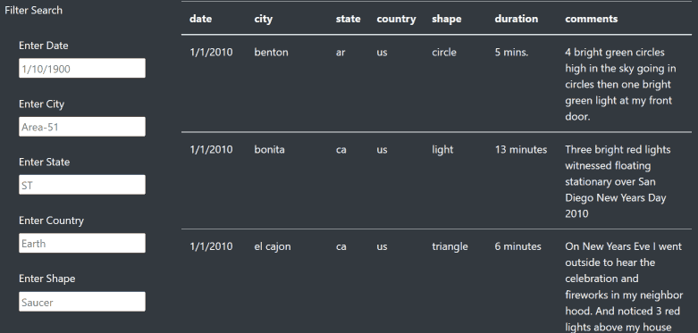
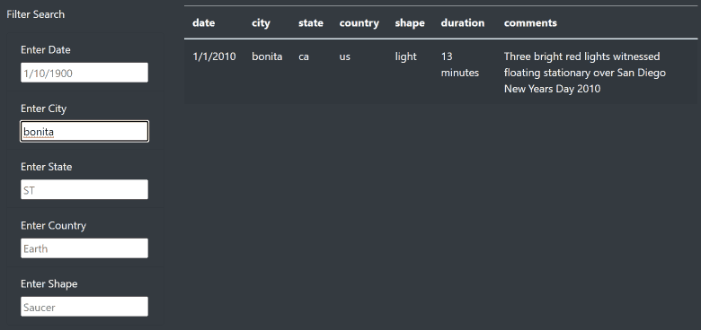
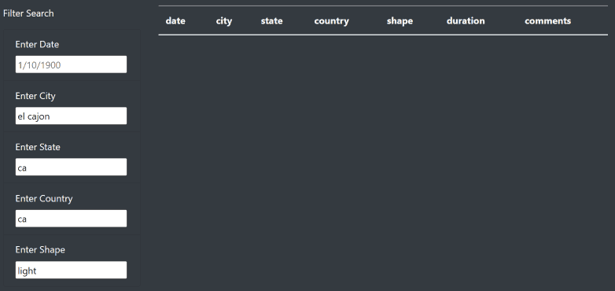
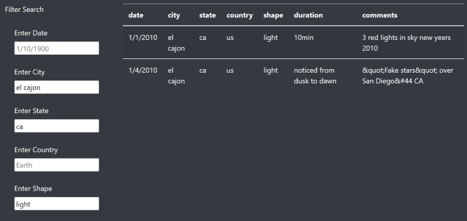
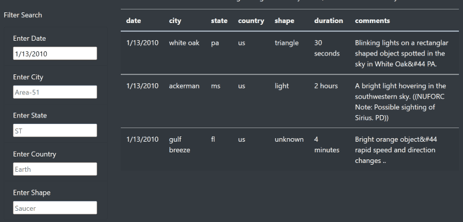

# UFOs
## The purpose of this project is to demonstrate the use of D3(a JavaScript DOM manipulation tool), and Bootstrap (A dynamic css template that allows for resizing, and some basic formatting). In the coding of this assignment, the use of arrow functions (fat arrow functions) is also demonstrated.

To filter the dataset provided, 5 input boxes are provided
  

Filtering the data is as simple as typing a complete word into a given input box (Partial word search not supported at this time)

For city we'll enter "bonita" (without quotes)

Only 1 result was found

--------------------------------------
Next, we'll try 

* Date: -leave empty-
* City: el cajon
* State: ca
* Country: ca
* Shape: light

No results should show

--------------------------------------

Go back and remove Country: ca   and make it blank

2 results should show

--------------------------------------

Now enter 1/13/2010 in the Date and clear the other fields

* Date: 1/13/2010
* City: -empty-
* State: -empty-
* Country: -empty-
* Shape: -empty-

3 results should show

--------------------------------------

## In Summary:
One drawback of this iteration of search interface, is the lack of partial word search, while you are typing it doesn't show any results. I recommend adding code to have the user's keypresses use as a partial search by adding a wild card to the end of the user's entry.  I also recommend adding code to populate a drop-down for the Shapes (by pre-scanning the dataset and grouping into a list of shapes used).  This could also be done for State and Country.
Of note is an observation made by a peer, Capital letters won't work in the search, adding code to format entries AND data to lower case would be a quick fix.

